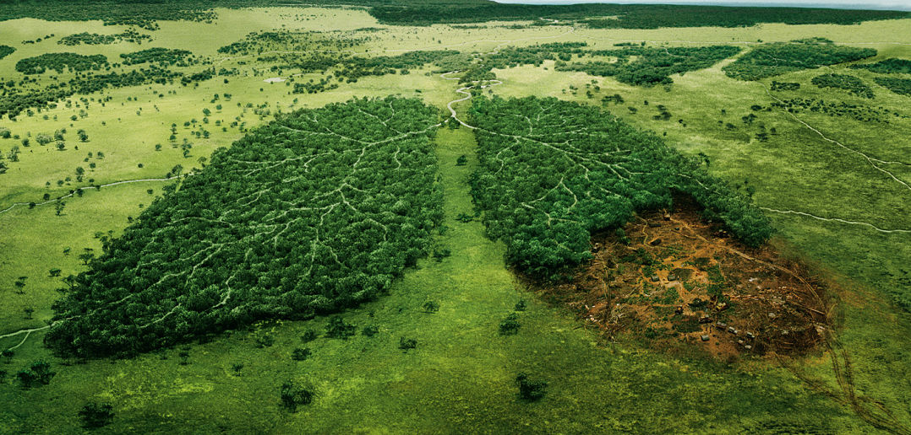

# Machine Learning Engineer Nanodegree
## Capstone Proposal
Kimia Hassanzadeh 
March 15th, 2018

### Domain Background

Deforestation is clearing Earth's forests on a massive scale, often resulting in damage to the quality of the land and affects climate change. According to [NationalGeography](https://www.nationalgeographic.com/environment/global-warming/deforestation/) 80% of Earth's land animals and plants live in forests, and many cannot survive the deforestation. Forests still cover about 30 percent of the world’s land area, but swaths half the size of England are lost each year. The world’s rain forests could completely vanish in a hundred years at the current rate of deforestation.

 

[Image resource](http://www.borgenmagazine.com/deforestation-new-threat-global-food-security/)

### Problem Statement

Data about the location of deforestation and human intrusion on forests can help governments and local stakeholders respond more quickly and effectively. Considerable amount of research has been devoted to tracking changes in forests, it typically depends on coarse-resolution imagery from Landsat (30 meter pixels) or MODIS (250 meter pixels). This limits its effectiveness in areas where small-scale deforestation or forest degradation dominate. Existing methods generally cannot differentiate between `human causes` of forest loss and `natural causes`. Higher resolution imagery has shown to be exceptionally good at this, but robust methods have not yet been developed for Planet imagery. 

In this project (taken from [kaggle](https://www.kaggle.com/c/planet-understanding-the-amazon-from-space)), the goal is to label satellite image chips with atmospheric conditions and various classes of land cover/land use. Resulting algorithms will help the global community better understand where, how, and why deforestation happens all over the world, and ultimately how to respond.

### Datasets and Inputs
_(approx. 2-3 paragraphs)_

The images for this problem were collected between January 1, 2016 and February 1, 2017 using 4-band satellites in Sun Synchronous Orbit (SSO) and International Space Station (ISS) orbit from the Amazon basin which includes Brazil, Peru, Uruguay, Colombia, Venezuela, Guyana, Bolivia, and Ecuador. Original images were in GeoTiff format and each contain four bands of data: red, green, blue, and near infrared but for this project all of the GeoTiff information regarding the chip footprint and ground control points (GCPs) are stripped off and they have a ground-sample distance (GSD) of 3.7m and an orthorectified pixel size of 3m.

The initial set of scenes (approx. `150,000`) was collected using Planet Explorer covering a land area of `30 million hectares`. Image set was then divided into two sets, a "hard" and an "easy" set. The easy set are easier to identify with labels: `primary rainforest`, `agriculture`, `habitation`, `roads`, `water`, and `cloud conditions`. The harder set of contains lables such as: `shifting cultivation`, `slash and burn agriculture`, `blow down`, `mining`, and `other phenomenon`.

Images were labeled using the Crowd Flower platform and a mixture of other teams and contains noisy data but data has a reasonably high signal to noise ratio and is sufficient for training.

The class labels are broken into three groups: 
  * Atmospheric conditions
  * Common land cover/land use phenomena
  * Rare land cover/land use phenomena 
  
Each image will have one and potentially more than one atmospheric label and zero or more common and rare labels. Images that are labeled as cloudy should have no other labels, but there may be labeling errors.
* Most Common Labels:
  * Cloud Label: Clouds are a major challenge for passive satellite imaging and can significantly complicate monitoring in the area. For this reason we have chosen to include a cloud cover label for each image. These labels closely mirror what one would see in a local weather forecast: `clear`, `partly cloudy`, `cloudy`, and `haze`
  * Primary Rain Forest: The majority of the data set is labeled as "primary", which is shorthand for primary rainforest as any area that exhibited dense tree cover.
  * Water (Rivers & Lakes): Rivers, reservoirs, and oxbow lakes are important features of the Amazon basin, this category of images are all tagged as water as a catch-all term for these features.
  * Habitation: This label refers to human homes or buildings in the image. This includes anything from dense urban centers to rural villages along the banks of rivers.
  * Cultivation: Shifting cultivation is a subset of agriculture and occurs in rural areas where individuals and families maintain farm plots for subsistence. This type of agriculture is often found near smaller villages along major rivers, and at the outskirts of agricultural areas. It typically relies on non-mechanized labor, and covers relatively small areas. 
  * Bare Ground: This label is catch-all term used for naturally occuring tree free areas that aren't the result of human activity and may occur naturally in the Amazon, while others may be the result from the source scenes containing small regions of biome much similar to the pantanal or cerrado. 
* Less Common Labels
  * Slash and Burn: It's a subset of the shifting cultivation label and is used for areas that demonstrate recent burn events. This is to say that the shifting cultivation patches appear to have dark brown or black areas consistent with recent burning.
  * Selective Logging: This label is used to cover the practice of selectively removing high value tree species from the rainforest.
  * Blooming: It is a natural phenomenon found in the Amazon where particular species of flowering trees bloom, fruit, and flower at the same time to maximize the chances of cross pollination.
  * Conventional Mining: There are a number of large conventional mines in the Amazon basin and the number is steadily growning. This label is used to classify large-scale legal mining operations.
  * Artisinal Mining Artisinal mining is a catch-all term for small scale mining operations. Throughout the Amazon, especially at the foothills of the Andes, gold deposits lace the deep, clay soils.
  * Blow down: also called windthrow, is a naturally occurring phenomenon in the Amazon. It occur during microbursts where cold dry air from the Andes settles on top of warm moist air in the rainforest. The colder air punches a hole in the moist warm layer, and sinks down with incredible force and high speed (in excess of 100MPH)
  

### Solution Statement
_(approx. 1 paragraph)_

In this section, clearly describe a solution to the problem. The solution should be applicable to the project domain and appropriate for the dataset(s) or input(s) given. Additionally, describe the solution thoroughly such that it is clear that the solution is quantifiable (the solution can be expressed in mathematical or logical terms) , measurable (the solution can be measured by some metric and clearly observed), and replicable (the solution can be reproduced and occurs more than once).

### Benchmark Model
_(approximately 1-2 paragraphs)_

In this section, provide the details for a benchmark model or result that relates to the domain, problem statement, and intended solution. Ideally, the benchmark model or result contextualizes existing methods or known information in the domain and problem given, which could then be objectively compared to the solution. Describe how the benchmark model or result is measurable (can be measured by some metric and clearly observed) with thorough detail.

### Evaluation Metrics
_(approx. 1-2 paragraphs)_

In this section, propose at least one evaluation metric that can be used to quantify the performance of both the benchmark model and the solution model. The evaluation metric(s) you propose should be appropriate given the context of the data, the problem statement, and the intended solution. Describe how the evaluation metric(s) are derived and provide an example of their mathematical representations (if applicable). Complex evaluation metrics should be clearly defined and quantifiable (can be expressed in mathematical or logical terms).

### Project Design
_(approx. 1 page)_

In this final section, summarize a theoretical workflow for approaching a solution given the problem. Provide thorough discussion for what strategies you may consider employing, what analysis of the data might be required before being used, or which algorithms will be considered for your implementation. The workflow and discussion that you provide should align with the qualities of the previous sections. Additionally, you are encouraged to include small visualizations, pseudocode, or diagrams to aid in describing the project design, but it is not required. The discussion should clearly outline your intended workflow of the capstone project.

-----------

**Before submitting your proposal, ask yourself. . .**

- Does the proposal you have written follow a well-organized structure similar to that of the project template?
- Is each section (particularly **Solution Statement** and **Project Design**) written in a clear, concise and specific fashion? Are there any ambiguous terms or phrases that need clarification?
- Would the intended audience of your project be able to understand your proposal?
- Have you properly proofread your proposal to assure there are minimal grammatical and spelling mistakes?
- Are all the resources used for this project correctly cited and referenced?
