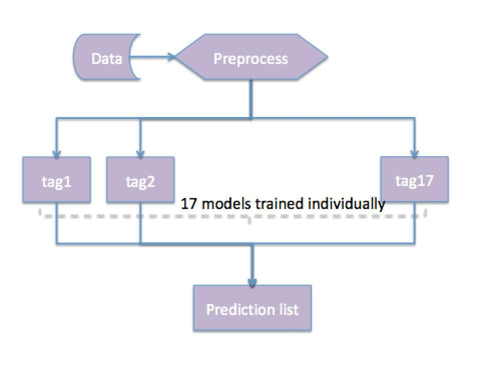

# Machine Learning Engineer Nanodegree
## Capstone Proposal
Kimia Hassanzadeh 
March 15th, 2018

### Domain Background

Deforestation is clearing Earth's forests on a massive scale, often resulting in damage to the quality of the land and affects climate change. According to [NationalGeography](https://www.nationalgeographic.com/environment/global-warming/deforestation/) 80% of Earth's land animals and plants live in forests, and many cannot survive the deforestation. Forests still cover about 30 percent of the world’s land area, but swaths half the size of England are lost each year. The world’s rain forests could completely vanish in a hundred years at the current rate of deforestation.

 

[Image resource](http://www.borgenmagazine.com/deforestation-new-threat-global-food-security/)

### Problem Statement

Data about the location of deforestation and human intrusion on forests can help governments and local stakeholders respond more quickly and effectively. Considerable amount of research has been devoted to tracking changes in forests, it typically depends on coarse-resolution imagery from Landsat (30 meter pixels) or MODIS (250 meter pixels). This limits its effectiveness in areas where small-scale deforestation or forest degradation dominate. Existing methods generally cannot differentiate between `human causes` of forest loss and `natural causes`. Higher resolution imagery has shown to be exceptionally good at this, but robust methods have not yet been developed for Planet imagery. 

In this project (taken from [kaggle](https://www.kaggle.com/c/planet-understanding-the-amazon-from-space)), the goal is to label satellite images with atmospheric conditions and various classes of land cover/land use. Resulting algorithms will help the global community better understand where, how, and why deforestation happens all over the world, and ultimately how to respond.

### Datasets and Inputs
_(approx. 2-3 paragraphs)_

The images for this problem were collected between January 1, 2016 and February 1, 2017 using 4-band satellites in Sun Synchronous Orbit (SSO) and International Space Station (ISS) orbit from the Amazon basin which includes Brazil, Peru, Uruguay, Colombia, Venezuela, Guyana, Bolivia, and Ecuador. Original images were in GeoTiff format and each contain four bands of data: red, green, blue, and near infrared but for this project all of the GeoTiff information regarding the footprint and ground control points (GCPs) are stripped off and they have a ground-sample distance (GSD) of 3.7m and an orthorectified pixel size of 3m.

The initial set of scenes (approx. `150,000`) was collected using Planet Explorer covering a land area of `30 million hectares`. Image set was then divided into two sets, a "hard" and an "easy" set. The easy set are easier to identify with labels: `primary rainforest`, `agriculture`, `habitation`, `roads`, `water`, and `cloud conditions`. The harder set of contains lables such as: `shifting cultivation`, `slash and burn agriculture`, `blow down`, `mining`, and `other phenomenon`.

Images were labeled using the Crowd Flower platform and a mixture of other teams and contains noisy data but data has a reasonably high signal to noise ratio and is sufficient for training.

The class labels are broken into three groups: 
  * Atmospheric conditions
  * Common land cover/land use phenomena
  * Rare land cover/land use phenomena 
  
Each image will have one and potentially more than one atmospheric label and zero or more common and rare labels. Images that are labeled as cloudy should have no other labels, but there may be labeling errors.
* Most Common Labels:
  * Cloud Label: Clouds are a major challenge for passive satellite imaging and can significantly complicate monitoring in the area. For this reason we have chosen to include a cloud cover label for each image. These labels closely mirror what one would see in a local weather forecast: `clear`, `partly cloudy`, `cloudy`, and `haze`
  * Primary Rain Forest: The majority of the data set is labeled as "primary", which is shorthand for primary rainforest as any area that exhibited dense tree cover.
  * Water (Rivers & Lakes): Rivers, reservoirs, and oxbow lakes are important features of the Amazon basin, this category of images are all tagged as water as a catch-all term for these features.
  * Habitation: This label refers to human homes or buildings in the image. This includes anything from dense urban centers to rural villages along the banks of rivers.
  * Cultivation: Shifting cultivation is a subset of agriculture and occurs in rural areas where individuals and families maintain farm plots for subsistence. This type of agriculture is often found near smaller villages along major rivers, and at the outskirts of agricultural areas. It typically relies on non-mechanized labor, and covers relatively small areas. 
  * Bare Ground: This label is catch-all term used for naturally occuring tree free areas that aren't the result of human activity and may occur naturally in the Amazon, while others may be the result from the source scenes containing small regions of biome much similar to the pantanal or cerrado. 
* Less Common Labels
  * Slash and Burn: It's a subset of the shifting cultivation label and is used for areas that demonstrate recent burn events. This is to say that the shifting cultivation patches appear to have dark brown or black areas consistent with recent burning.
  * Selective Logging: This label is used to cover the practice of selectively removing high value tree species from the rainforest.
  * Blooming: It is a natural phenomenon found in the Amazon where particular species of flowering trees bloom, fruit, and flower at the same time to maximize the chances of cross pollination.
  * Conventional Mining: There are a number of large conventional mines in the Amazon basin and the number is steadily growning. This label is used to classify large-scale legal mining operations.
  * Artisinal Mining: It's a catch-all term for small scale mining operations. Throughout the Amazon, especially at the foothills of the Andes, gold deposits lace the deep, clay soils.
  * Blow down: Also called windthrow, is a naturally occurring phenomenon in the Amazon. It occur during microbursts where cold dry air from the Andes settles on top of warm moist air in the rainforest. The colder air punches a hole in the moist warm layer, and sinks down with incredible force and high speed (in excess of 100MPH)
  

### Solution Statement

The collected data for this project is moslty images which brings up 2 main approaches to attack the problem:
 * 1- Creating feature vectors based on image data for each input and use classical Machine Learning algorithms such as SVM to mine patterns and make predictions 
 * 2- Developing Convolutional Neural Network and take a Deep Learning approach or Transfer Learning
Becuase there are multiple labels per image, solution requires training individual models per tag (label) and merge results in the final step based on confidence levels and setting thresholds.

### Benchmark Model

Highest scores on [kaggle leaderboard](https://www.kaggle.com/c/planet-understanding-the-amazon-from-space/leaderboard) submissions are approximately 93%. Some of the best submissions have used transfer learning (ex. VGG16) but the rest of the submissions are private so their approaches are not publicly shared. Scores presented in leaderboard are mewn(F2_scores) and they are calculated with approximately 34% of the test data. The mean (F2_score) is formed by averaging the individual F2_scores for each row in the test set.

A good CNN should be able to reach a reasonable score above 90%, however there might be obstacles on the road to achieve this score such as limited access to AWS EC2 GPU instances and computational costs to run models with sufficient number of epochs and beat these scores.

### Evaluation Metrics

The F score, commonly used in information retrieval, measures accuracy using the precision p and recall r. Precision is the ratio of true positives (tp) to all predicted positives (tp + fp). Recall is the ratio of true positives to all actual positives (tp + fn). 
F2_score weights recall higher than precision and it would the main evaluation metric for this problem set, meaning that how many of the deforestations are actually detected by the model.

### Project Design

* Platform : Python 3.6
* Libraries : Keras, Tensorflow, Scikit-learn, Opencv
* Algorithm :
   * Step1: Downloading & preprocessing the dataset, as an initial step we need to know how many labels are currently used in the dataset as tags and associate image paths to tag ids, resizing and down-scaling the images might also be a step to consider to reduce training time
   * Step2: Breaking dataset into train/validation set 
   * Step3: Doing data exploration on tags and drawing barcharts to gain more insight about the data and tags
   * Step4: Trying out different CNN architectures on the dataset as well as transfer learning from VGG16, VGG19, Resnet50 and Inception
   * Step5: For building multilabel models, I'll train one model for each tag and that model is trained to distinguish between that tag and all the other tags and merge results together per image as the final output prediction.
   * Optional Step: I'd like to observe how clustering would work on images, as an experiemtn I'd create feature vectors of color histograms, spatial features and tags for each image and apply an unsupervised algorithm to find out about possible clusters and groups of images and tags.

 
